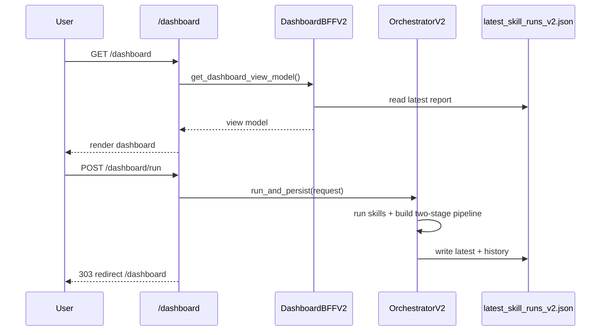

# Trading Skills Dashboard FLOW

이 문서는 현재 프로젝트(`trading_stock_skills`)의 **실제 코드 기준 분석/실행 흐름**을 정리한 운영·디자인 공용 기준서입니다.  
목적은 다음 3가지입니다.

1. 기능 설계/화면 설계 시 데이터 흐름을 한 번에 이해
2. 장애 원인 분석 시 어느 단계에서 깨졌는지 빠르게 추적
3. 변경 작업 후 테스트/검증 순서를 표준화

---

## 1) 시스템 맵

### 1.1 핵심 컴포넌트
- Web App: `src/trading_skills_engine/web/app.py`
- Dashboard BFF: `src/trading_skills_engine/web/services/dashboard_bff_v2.py`
- v2 Orchestrator: `src/trading_skills_engine/engine/orchestrator_v2.py`
- Skill Traits: `src/trading_skills_engine/skills_v2/traits.py`
- v2 Contracts: `src/trading_skills_engine/skills_v2/contracts.py`
- 런타임/FMP 설정: `src/trading_skills_engine/config/fmp_runtime.py`
- 데이터 소스 로더: `src/trading_skills_engine/data/provider.py`

### 1.2 산출물/상태 파일
- 최신 v2 실행 리포트: `reports/skill_runs/latest_skill_runs_v2.json`
- 실행 히스토리: `reports/skill_runs/history_v2/*.json`
- FMP 사용량: `reports/runtime/fmp_usage.json`
- FMP 런타임 토글 설정: `reports/runtime/fmp_settings.json`
- 진단 리포트(유니크니스/독립성): `reports/diagnostics/*.json`, `reports/diagnostics/*.html`

---

## 2) End-to-End 실행 FLOW

### 2.1 사용자 대시보드 실행 흐름
1. 사용자가 `/dashboard` 접속
2. `DashboardBFFV2.get_dashboard_view_model()`이 최신 리포트 로드
3. 스킬 카탈로그 + trait(role/style) + 결과를 결합해 ViewModel 생성
4. `dashboard.html` 렌더
5. 사용자가 추천/분석 스킬 선택 후 `POST /dashboard/run`
6. 서버가 폼을 정규화
7. 추천 최대 5개, 분석 최대 3개로 trim
8. `EngineRunRequestV2(top_picks_mode="two_stage_intersection")` 생성
9. `SkillEngineOrchestratorV2.run_and_persist()` 실행
10. 최신 리포트 저장 후 `/dashboard`로 리다이렉트

### 2.2 API 직접 실행 흐름
1. `POST /api/v2/skills/run` 호출
2. payload를 `EngineRunRequestV2`로 검증
3. v2 orchestrator 실행
4. 응답 반환 + 리포트 저장

---

## 3) Orchestrator 내부 분석 FLOW (v2)

## 3.1 공통 전처리
1. `selected_skills` sanitize (중복/길이/형식)
2. 선택이 비어 있으면 전체 스킬 대상으로 fallback
3. `AnalyzerContext` 생성
4. 각 스킬 analyzer를 registry에서 조회
5. 실행 결과를 `SkillRunResultV2`로 누적
6. 예외 발생 시 `unavailable` 처리

## 3.2 top_picks_mode 분기
- `two_stage_intersection`이면 `_build_two_stage_pipeline()` 실행
- 그 외 모드는 legacy consensus 빌더 실행

---

## 4) Two-Stage Intersection 상세 FLOW

### 4.1 입력 정책 확정
- 추천 스킬 소스:
  - 우선 `pipeline_config.recommender_skills`
  - 없으면 `params_by_skill["top-picks"]["recommender_skills"]`
  - 그래도 없으면 ok 결과 중 trait role이 `direct|candidate`
- 분석 스킬 소스:
  - 우선 `pipeline_config.analyzer_skills`
  - 없으면 `params_by_skill["top-picks"]["analyzer_skills"]`
  - 그래도 없으면 ok 결과 중 trait role이 `analysis_only`
- 강제 제한:
  - recommender: 최대 5
  - analyzer: 최대 3
- policy:
  - `analyzer_pass_policy`: `all_pass` 또는 `pass_or_watch`
  - 비교 모드: `comparison_mode` (optional)
  - all_pass 실패 시 watch fallback 옵션: `fallback_to_watch_on_empty`

### 4.2 Stage A: 추천 스킬별 독립 결과 생성
1. 스킬별 payload에서 종목/점수 추출
2. 점수 소스 우선순위:
   - `top_candidates.composite_score/score`
   - `leaders.score`
   - `targets.target_weight_pct`
   - `candidates.setup_score/score`
   - `earnings.market_cap`
   - `ranked_events.impact_score + related_tickers`
   - 마지막 fallback: payload에서 추출된 symbol
3. 각 스킬 내 rank 계산
4. 퍼센타일 계산:
   - `percentile = ((total - rank_idx - 1) / (total - 1)) * 100`
5. 결과 구조:
   - `pipeline.recommender_outputs[]`

### 4.3 Stage A-2: 추천 교집합 + 합집합 TOP10
1. strict intersection
   - 추천 스킬 2개 이상: 실제 교집합 계산
   - 추천 스킬 1개: 교집합은 빈값(의미상 intersection 미사용)
2. union 집계
   - 종목별 `normalized_by_skill` 누적
   - `support_count` = 해당 종목을 지지한 추천 스킬 수
   - `composite_score` = 퍼센타일 합
3. 정렬 우선순위
   - `support_count` desc
   - `composite_score` desc
   - `symbol` asc
4. 상위 10개 절단
5. 결과 구조:
   - `pipeline.recommender_intersection`
   - `pipeline.recommender_union_top10`
   - `pipeline.analysis_targets`

### 4.4 Stage B: 분석 스킬 평가
1. 대상 그룹 2개를 각각 분석
   - `intersection_symbols`
   - `top10_symbols`
2. 분석 스킬별 종목 평가 함수:
   - `_evaluate_symbol_for_analyzer()`
3. 점수 구성(요약)
   - skill base score
   - confidence
   - symbol match bonus
   - candidate rank bonus
   - ai factor
   - momentum
   - style weight(스킬 trait style 기반)
4. 의사결정
   - score >= 65: `PASS`
   - score >= 45: `WATCH`
   - else: `REJECT`
5. 결과 구조:
   - `pipeline.analyzer_outputs`
   - `pipeline.analyzer_outputs_by_target`

### 4.5 Stage C: 최종 필터링/랭킹
1. 정책별 통과집합 계산
   - `all_pass`면 PASS만 허용
   - `pass_or_watch`면 PASS/WATCH 허용
2. 교집합/Top10 대상 각각 필터
3. all_pass 결과가 비고 fallback 옵션이 켜져 있으면
   - `pass_or_watch`로 재평가 폴백
4. 최종 점수 계산(Top10 대상)
   - `final_score = support_count*20 + analyzer_avg*0.8 - volatility*0.3`
5. 최종 출력
   - `final_intersection_symbols`
   - `final_summary.top5_from_top10`
   - `top_picks` 요약 카드

### 4.6 빈 결과/경고 처리
- 단계별 탈락은 `dropped_by_stage`에 저장
- role 불일치/스킬 누락/초과 trim은 `warnings`에 기록

---

## 5) Dashboard ViewModel 생성 FLOW

1. v2 리포트 JSON 로드
2. `SKILL_CATALOG` + trait 결합
3. 결과(`results`) enrich (display_name/family 추가)
4. pipeline 섹션 normalize
5. symbol 한글 별칭 매핑
6. left menu 분리
   - recommender role(`direct|candidate`)
   - analyzer role(`analysis_only`)
7. 카운터/요약/리스크 배지 포함
8. 템플릿 렌더

디자인 관점 포인트:
- 섹션은 입력(왼쪽)과 결과(오른쪽)를 단계별로 매핑
- 표는 “추천-분석-최종” 순서를 유지해야 인지 부하가 낮음
- 정책(`all_pass`/`pass_or_watch`)과 빈결과 원인은 항상 노출

---

## 6) Data Source & Fallback FLOW

### 6.1 시장 데이터
- 우선 FMP live quote 시도
- 실패/미구성 시 sample market state fallback

### 6.2 FMP 런타임 제어
- ON/OFF 토글 + API Key 구성 상태 분리
- 실제 호출 가능 조건:
  - `toggle_enabled == true`
  - `FMP_API_KEY` 존재
- 일일 호출량 추적:
  - 기본 한도 250/day
  - `FMPUsageTracker.try_consume()`

### 6.3 상태 배지 의미
- `live`: 실시간/신선 데이터 기반
- `stale`: 캐시 또는 신선도 저하 데이터
- `unavailable`: 데이터 소스 사용 불가

---

## 6.1) AI 최종 리포트 FLOW (GLM 4.5)

1. 사용자 수동 실행: `POST /dashboard/ai-report/run`
2. 소스 리포트 로드: `latest_skill_runs_v2.json`
3. 대상 추출:
   - `pipeline.final_summary.top5_from_top10` 우선
   - 없으면 `top_picks` 상위 5개
4. 근거 수집:
   - Yahoo Finance -> Stooq -> FMP -> 내부 파이프라인
5. GLM 4.5 호출(Zhipu 전용 chat/completions)
6. 출력 정규화:
   - `BUY/WATCH/AVOID`
   - score/confidence
   - 한국어 근거/리스크
7. 저장:
   - `reports/ai/latest_ai_report.json`
   - `reports/ai/history/<run_id>.json`

버튼 비활성 조건:
1. `GLM_API_KEY` 미설정
2. 분석 대상 TOP5 없음

---

## 7) 독립성(Independence) 해석 기준

### 7.1 독립성의 정의(현재 코드 기준)
- 각 스킬은 자기 payload + 자기 점수로 실행
- 다른 스킬의 score/decision을 직접 참조하지 않음
- 스킬 간 결합은 파이프라인 집계 단계에서만 수행

### 7.2 종목이 비슷하게 나오는 이유
- 동일 시장 상태/동일 유니버스 기반 입력
- 대형주 중심 공통 시그널이 겹칠 수 있음
- 이는 “종속 버그”와 다른 현상

### 7.3 품질 감시 파일
- uniqueness 보고서
- independence 보고서
- 두 리포트가 모두 pass일 때 “중복/종속 이상 없음”으로 판단

---

## 8) 운영 검증 FLOW (변경 후 필수)

권장 순서:
1. 단위/통합 테스트
2. 서버 재시작
3. `/healthz`, `/dashboard` 확인
4. uniqueness 진단
5. independence 진단

실행 스크립트:
- `scripts/verify_after_change.sh`
- `scripts/dashboard_server.sh restart`

---

## 9) 디자인 문서로 전환할 때 필요한 화면 단위

디자인 산출물은 아래 단위로 쪼개면 구현 대응이 쉽습니다.

1. 전역 헤더
   - 앱명, 날짜, 데이터소스 배지, FMP 토글/사용량
2. 좌측 컨트롤
   - 추천 스킬 선택, 분석 스킬 선택, 티커 필터, 실행 버튼
3. 결과 요약 카드
   - 추천 카드, TOP5 카드
4. 추천 단계 테이블
   - 스킬별 결과, 교집합, 합집합 TOP10
5. 분석 단계 테이블
   - target(intersection/top10)별 평가
6. 최종 단계
   - 최종 교집합, 최종 TOP5, 경고/배지

---

## 10) 장애 분석 Playbook

### 10.1 `ERR_CONNECTION_REFUSED`
1. `scripts/dashboard_server.sh status`
2. `scripts/dashboard_server.sh restart`
3. `scripts/dashboard_server.sh ensure`
4. `scripts/dashboard_watchdog.sh status` (미동작 시 `scripts/dashboard_watchdog.sh start`)
5. `curl http://127.0.0.1:8001/healthz`
6. 로그(`/tmp/trading_skills_8001.log`, `/tmp/trading_skills_watchdog_8001.log`) 확인

### 10.2 결과가 전부 동일/근거 없음으로 보일 때
1. 해당 스킬 payload에 symbol-level row가 있는지 확인
2. `top_candidates/leaders/candidates/ranked_events` 유무 확인
3. fallback reason(`*_derived`, `payload_extract`) 비율 확인
4. uniqueness 리포트에서 duplicate group 확인

### 10.3 최종 결과가 0개일 때
1. `analyzer_pass_policy` 확인 (`all_pass`가 과도하게 엄격할 수 있음)
2. `fallback_to_watch_on_empty` 적용 여부 확인
3. `dropped_by_stage` 확인

---

## 11) 향후 확장 제안 (디자인/기획용)

1. 정책 스위치 UI
   - all_pass / pass_or_watch A/B 비교
2. 근거 가독화
   - `normalized_by_skill`를 표 형태로 변환
3. 단계별 로그 뷰어
   - dropped_by_stage + warnings 시각화
4. 결과 재현성 배지
   - 데이터 소스(live/stale/sample) 기반 신뢰 배지
5. Core Web Vitals 대시보드
   - `/dashboard` 성능 지표 추적

---

## 12) 빠른 참조 시퀀스

---

## 13) 문서 유지 규칙

이 문서는 코드 변경 시 함께 업데이트합니다.

업데이트 트리거:
1. `contracts.py` 타입 필드 변경
2. `orchestrator_v2.py` 파이프라인 로직 변경
3. `dashboard_bff_v2.py` ViewModel 필드 변경
4. 대시보드 좌측 입력 폼 구조 변경
5. 운영 스크립트/검증 스크립트 변경
