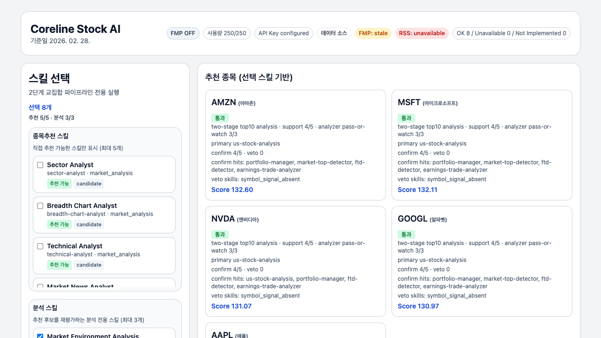
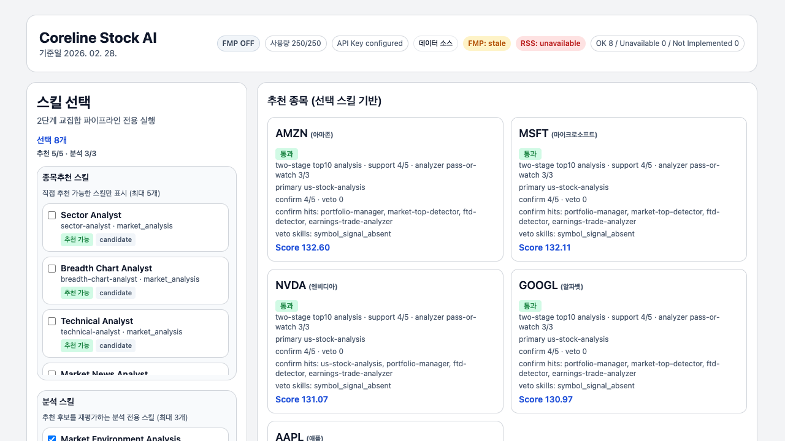

# Trading Skills Engine + Dashboard

FastAPI 기반 트레이딩 스킬 실행 엔진과 대시보드입니다.  
현재 카탈로그는 **38개 스킬**이며, 대시보드는 **v2 2단계 교집합 파이프라인**을 기본 실행 경로로 사용합니다.

원본 아이디어/레퍼런스:
- https://github.com/tradermonty/claude-trading-skills

## Table of Contents
- [핵심 기능](#핵심-기능)
- [아키텍처 개요](#아키텍처-개요)
- [빠른 시작](#빠른-시작)
- [동작 화면](#동작-화면)
- [대시보드 사용법](#대시보드-사용법)
- [API 사용법](#api-사용법)
- [스킬 독립 실행 원칙](#스킬-독립-실행-원칙)
- [진단/테스트](#진단테스트)
- [FMP 연동 및 런타임 토글](#fmp-연동-및-런타임-토글)
- [산출물 경로](#산출물-경로)
- [트러블슈팅](#트러블슈팅)
- [레거시(v1) 엔드포인트](#레거시v1-엔드포인트)

## 핵심 기능
- **38개 스킬 카탈로그 실행**
  - 패밀리 분포: `market_analysis(11)`, `calendar(2)`, `strategy_risk(7)`, `market_timing(2)`, `earnings_momentum(2)`, `screening(8)`, `edge_research(4)`, `quality_orchestration(2)`
- **구현 방식**
  - 전용 구현 스킬: 10개 (`economic-calendar-fetcher`, `earnings-calendar`, `market-news-analyst`, `us-stock-analysis`, `market-breadth-analyzer`, `uptrend-analyzer`, `market-top-detector`, `ftd-detector`, `earnings-trade-analyzer`, `portfolio-manager`)
  - 나머지 스킬: trait 기반 `proxy` 분석기
- **대시보드 실행 모델**
  - 추천 스킬(최대 5) + 분석 스킬(최대 3) 분리 선택
  - `two_stage_intersection` 파이프라인 고정 실행
  - 티커 필터(개별/멀티) 지원
  - 한글 티커 별칭 표시, 단계별 테이블/최종 TOP5 제공
- **운영 안전장치**
  - FMP ON/OFF 토글 + 일일 호출량 표시(예: `121/250`)
  - API/네트워크 장애 시 stale cache/대체 소스 처리
  - 자동 회귀 검증 + uniqueness/independence 감사 스크립트

## 아키텍처 개요
1. `POST /dashboard/run` 또는 `POST /api/v2/skills/run`으로 실행 요청
2. `SkillEngineOrchestratorV2`가 선택 스킬 실행
3. 결과를 `reports/skill_runs/latest_skill_runs_v2.json` + `history_v2/`에 저장
4. `DashboardBFFV2`가 리포트를 정규화해 `/dashboard` 렌더
5. 진단 스크립트로 uniqueness/independence 품질 점검

## 빠른 시작
### 1) 설치
```bash
python3.11 -m venv .venv
source .venv/bin/activate
pip install -e '.[dev]'
```

### 2) 서버 실행
```bash
# start | stop | restart | status | check
scripts/dashboard_server.sh restart
scripts/dashboard_server.sh status
```

접속:
- `http://127.0.0.1:8001/dashboard`
- `http://127.0.0.1:8001/healthz`

### 3) 직접 uvicorn 실행(대안)
```bash
python3.11 -m uvicorn trading_skills_engine.web.app:app --host 127.0.0.1 --port 8001
```

## 동작 화면
### Dashboard - Top View


### Dashboard - Mid View


## 대시보드 사용법
대시보드 왼쪽 메뉴는 파이프라인 전용입니다.

1. **종목추천 스킬**에서 1~5개 선택  
2. **분석 스킬**에서 1~3개 선택  
3. 필요 시 **티커 필터** 입력 (`single_ticker`, `multi_tickers`)  
4. `선택한 스킬 실행` 클릭

결과 섹션:
- 추천 종목 카드
- 추천 스킬별 결과 테이블
- 추천 교집합
- 추천 합집합 정규화 TOP10
- 분석 스킬별 평가(타겟 분리: intersection/top10)
- 최종 결과 요약(최종 교집합 + 최종 TOP5)

## API 사용법
### v2 엔드포인트
- `GET /api/v2/skills`
- `POST /api/v2/skills/run`
- `GET /api/v2/engine/status`

### v2 실행 예시 (two-stage)
```bash
curl -X POST http://127.0.0.1:8001/api/v2/skills/run \
  -H "Content-Type: application/json" \
  -d '{
    "selected_skills": [
      "sector-analyst",
      "technical-analyst",
      "vcp-screener",
      "macro-regime-detector"
    ],
    "as_of_date": "2026-02-28",
    "top_picks_mode": "two_stage_intersection",
    "pipeline_config": {
      "recommender_skills": ["sector-analyst", "technical-analyst", "vcp-screener"],
      "analyzer_skills": ["macro-regime-detector"],
      "recommender_top_n": 25,
      "intersection_policy": "strict",
      "analyzer_pass_policy": "all_pass",
      "comparison_mode": false
    }
  }'
```

### top_picks_mode 지원
- `skill_consensus`
- `watchlist_consensus`
- `role_gated_consensus`
- `two_stage_intersection`

## 스킬 독립 실행 원칙
현재 코드 기준 독립성 규칙:
- 각 스킬은 **자기 payload/자기 점수**로 실행됨
- 다른 스킬의 점수/판정이 해당 스킬 내부 계산에 영향을 주지 않음
- 스킬 간 결합은 파이프라인의 **최종 집계 단계(교집합/합집합/TOPN)** 에서만 수행

참고:
- 같은 시장 스냅샷을 읽는 구조이므로 종목군이 일부 겹칠 수는 있습니다.
- 이는 데이터 우주/시장 상태 공통 입력에 따른 현상이며, 스킬 간 직접 종속과는 다릅니다.

## 진단/테스트
### 전체 회귀
```bash
python3.11 -m pytest -q
```

### 변경 후 통합 검증 (권장)
```bash
scripts/verify_after_change.sh
```
실행 항목:
1. 핵심 테스트
2. 서버 재시작 + `/dashboard` 헬스 체크
3. `/dashboard` 엔드포인트 검증
4. uniqueness 감사
5. independence 감사

### 유니크니스 감사
```bash
python3.11 scripts/run_full_skill_uniqueness_report.py
```
- JSON: `reports/diagnostics/latest_skill_uniqueness_report.json`
- HTML: `reports/diagnostics/latest_skill_uniqueness_report.html`

### 독립성 감사
```bash
python3.11 scripts/run_skill_independence_report.py
```
- JSON: `reports/diagnostics/latest_skill_independence_report.json`
- HTML: `reports/diagnostics/latest_skill_independence_report.html`

## FMP 연동 및 런타임 토글
`.env` 또는 환경변수로 `FMP_API_KEY`를 설정하면 FMP 기반 조회를 활성화할 수 있습니다.

```bash
cat > .env <<'EOF'
FMP_API_KEY=your_key
EOF
```

런타임 제어:
- 대시보드 상단 `FMP ON/OFF` 토글
- 사용량 라벨 `used_today/daily_limit`

관련 파일:
- 설정: `reports/runtime/fmp_settings.json`
- 사용량: `reports/runtime/fmp_usage.json`

기본값:
- 일일 호출 한도: `250`
- Base URL: `https://financialmodelingprep.com/stable`

추가 환경 변수:
- `TRADING_SKILLS_ENV_FILE` : `.env` 경로 오버라이드
- `TRADING_SKILLS_DISABLE_DOTENV=1` : `.env` 자동 로드 비활성화
- `SKILL_RUN_REPORT_V2_PATH` : v2 리포트 저장 위치 변경
- `FMP_RUNTIME_SETTINGS_PATH` : FMP 런타임 설정 파일 경로 변경

## 산출물 경로
- v2 최신 리포트: `reports/skill_runs/latest_skill_runs_v2.json`
- v2 히스토리: `reports/skill_runs/history_v2/*.json`
- 진단 리포트: `reports/diagnostics/*.json`, `reports/diagnostics/*.html`
- 런타임(FMP): `reports/runtime/*.json`
- 레거시(v1) 리포트: `reports/skill_runs/latest_skill_runs.json`

## 트러블슈팅
### `ERR_CONNECTION_REFUSED` / 대시보드 미접속
```bash
scripts/dashboard_server.sh status
scripts/dashboard_server.sh restart
curl -fsS http://127.0.0.1:8001/healthz
```

### `API Key missing`
- `.env`에 `FMP_API_KEY` 설정 확인
- 대시보드 상단 `API Key configured/missing` 배지 확인
- 토글이 OFF면 ON으로 전환

### 호출 한도 초과 (`FMP_DAILY_LIMIT_REACHED`)
- 다음 중 하나 수행:
  - FMP 토글 OFF
  - 호출량 초기화(날짜 경과)
  - 한도 상향(설정 파일)

## 레거시(v1) 엔드포인트
호환을 위해 v1 API도 유지합니다.

- `GET /api/v1/skills`
- `POST /api/v1/engine/run`
- `GET /api/v1/engine/status`
- `GET /api/v1/dashboard/header`
- `GET /api/v1/dashboard/strategy-weighting`
- `GET /api/v1/dashboard/market-overview`
- `GET /api/v1/dashboard/top-picks`
- `GET /api/v1/dashboard/footer-nav`
- `GET /api/v1/dashboard/skills`
- `GET /api/v1/dashboard/skill-results`
